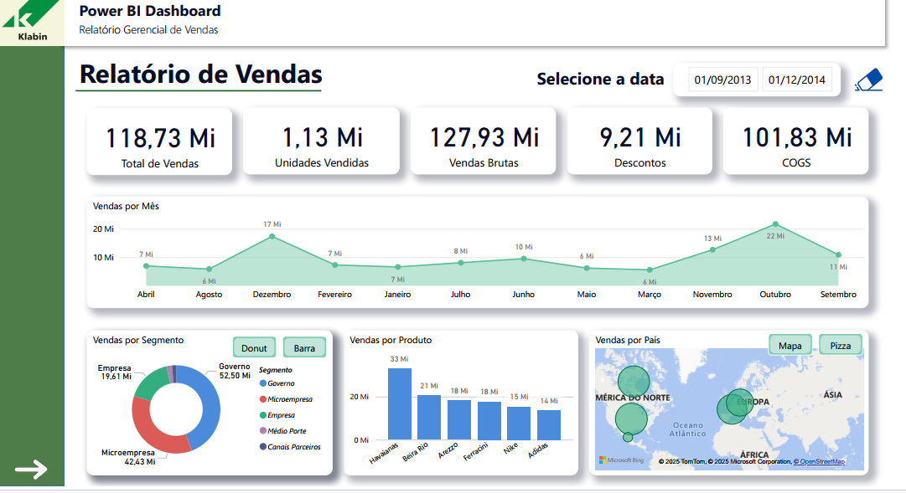
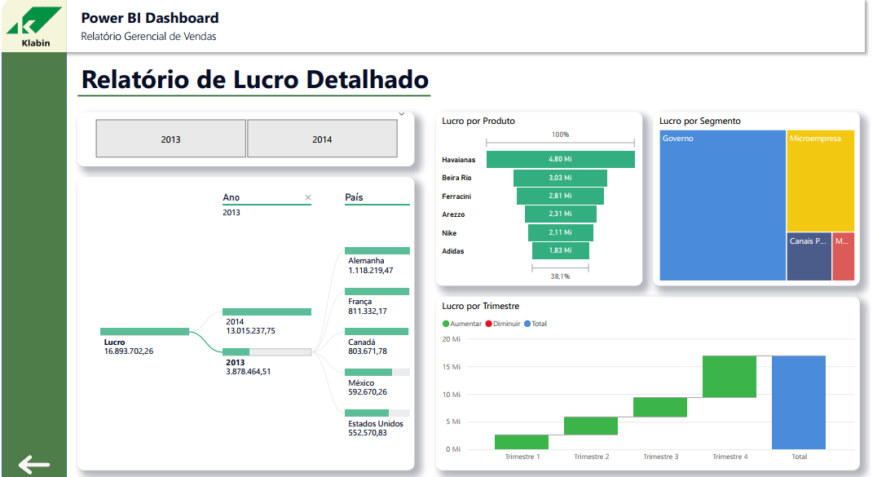

# 📊 Relatório Gerencial de Vendas – Power BI

Este repositório contém o dashboard **Relatório Gerencial de Vendas**, desenvolvido em **Power BI**, com foco em acompanhamento de resultados comerciais e lucratividade por período, segmento, produto e país.

O objetivo é oferecer uma visão rápida e interativa da performance de vendas, apoiando decisões estratégicas e táticas da área comercial.

---

## 📌 Página 1 – Relatório de Vendas

A primeira página traz uma visão geral do desempenho de vendas no período selecionado (ex.: 01/09/2013 a 01/12/2014), incluindo:

- **Indicadores principais**:
  - Total de Vendas
  - Unidades Vendidas
  - Vendas Brutas
  - Descontos
  - COGS (Custo das Mercadorias Vendidas)

- **Principais visuais**:
  - Vendas por Mês (série temporal por mês/ano).
  - Vendas por Segmento (ex.: Governo, Empresa, Microempresa, Canais Parceiros, Médio Porte).
  - Vendas por Produto (ex.: Havaianas, Beira Rio, Arezzo, Ferracini, Nike, Adidas).
  - Vendas por País (mapa geográfico).

### Pré-visualização

---

## 💰 Página 2 – Relatório de Lucro Detalhado

A segunda página aprofunda a análise de **lucro**, permitindo entender melhor a rentabilidade por ano, país, produto e período.

- **Indicadores principais**:
  - Lucro Total por Ano (ex.: 2013 e 2014).
  - Lucro por País (Alemanha, França, Canadá, México, Estados Unidos, etc.).
  - Lucro por Produto (participação percentual e valores em milhões).

- **Principais visuais**:
  - Lucro por Trimestre (T1 a T4) com destaque para aumento/diminuição.
  - Lucro por Segmento (ex.: Governo, Microempresa, Canais Parceiros, etc.).
  - Ranking de produtos por contribuição de lucro.

### Pré-visualização

---

## ⚙️ Funcionalidades do Dashboard

- Indicadores para os botões que alternam o tipo de visualização em alguns gráficos (barra, donut, pizza e mapa), permitindo analisar os mesmos dados sob diferentes perspectivas.
- Botão de navegação entre páginas, facilitando a troca entre o **Relatório de Vendas** e o **Relatório de Lucro Detalhado**.
- Indicador para o botão de “borracha” para limpar/zerar os filtros de data da primeira página, retomando a visão geral sem necessidade de ajustar manualmente os filtros.

---

## 🚀 Como Utilizar o Relatório

1. Abra o arquivo `.pbix` no **Power BI Desktop** (versão compatível mais recente).
2. Ajuste, se necessário:
   - Fontes de dados.
   - Parâmetros de data.
   - Medidas DAX específicas do seu contexto.
3. Utilize os filtros e segmentações da interface para explorar diferentes períodos, países, segmentos e produtos.

